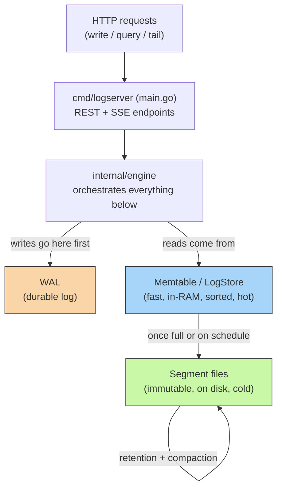
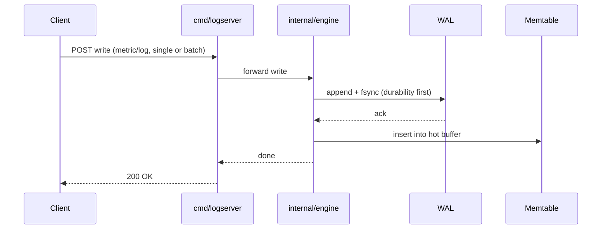

# homelab-tsdb

A single-binary, Go-native time-series + log store built for homelabs — the answer to *"why do I need Prometheus + Loki + Grafana + a message queue just to know if my Plex server is healthy."*

One process. No external dependencies. Runs comfortably on a Raspberry Pi.

Started as a personal project, fully separate from any day job, aimed at eventually becoming a real product for the self-hosting community.

## Architecture at a glance

### Write path (sequence)

## The building blocks

**1. WAL (`internal/wal`) — robustness**
Every write is appended to a file and `fsync`'d to disk *before* the caller is told "done." This is the crash guarantee — tested by `kill -9`'ing the server mid-write (no graceful shutdown, the worst case) and confirming the write still came back after restart via `Replay()`. Same durability pattern every real database uses.

**2. Memtable + LogStore (`internal/storage`) — fast in-memory query**
Two parallel in-memory buffers:
- One for numeric metric `Point`s (sorted by timestamp per series)
- One for text `LogEntry`s (sorted by timestamp, filterable by source/level/substring, and now by arbitrary structured fields)

This is what makes recent data queryable instantly without touching disk.

**3. Segments (`internal/storage/segment.go`) — bounded memory, durable storage**
Once the hot buffers pass a size threshold, their contents are encoded and written atomically (temp file + rename, so a crash mid-flush can't corrupt an existing segment) to an immutable file on disk. After a successful flush, the WAL is truncated to zero and the in-memory buffers clear — this is what stops memory from growing forever.

Segments are now also subject to **retention** (aged-out data is dropped) and **compaction** (older segments merged), including data that only ever existed in the WAL — replayed WAL entries are compacted into a segment immediately on `Open()`, so nothing recovered on restart can silently dodge retention.

**4. Envelope (`internal/storage/envelope.go`) — one log, two data types, structured fields**
A single-byte "kind" tag lets one WAL stream carry both metric points and log entries, so there's no need for two separate durability systems. The on-disk record now also carries an `ID` and a `Fields []byte` blob (structured JSON), so log entries can hold arbitrary key/value fields, not just source/level/message.

**Engine (`internal/engine`)** ties all of this together, guarded by a `sync.RWMutex` (read-only queries take `RLock`, writes/flushes take exclusive `Lock`). On startup it replays the WAL (recovering anything since the last flush) then loads existing segments (recovering everything before that), giving one consistent view across "hot" and "cold" data for both writes and queries.

## Phase 2 additions (since last README)

- **Structured fields** — log entries carry arbitrary key/value fields, queryable individually
- **Batch ingestion** — write many points/entries in one request instead of one at a time
- **Field-based query filters** — query by specific structured field values, not just source/level/substring
- **Live tail** — stream new log entries in real time via Server-Sent Events
- **Retention & compaction** — old data ages out automatically; segments merge over time; WAL-replayed data is compacted immediately so it can't escape retention
- **Basic auth** — the server is no longer wide open to anyone who can reach the port
- **Web UI** — dark-mode UI served alongside the API for browsing/querying without a separate tool
- **Export** — pull query results out as CSV or JSON

> Note: the exact route names for batch write, live tail, and export aren't reflected in the API table below yet — send them over and I'll fill the table in precisely rather than guess.

## API

`cmd/logserver` exposes everything over HTTP, all JSON in/out unless noted:

| Method | Endpoint | Purpose |
|---|---|---|
| `POST` | `/write/metric` | Write a metric point |
| `POST` | `/write/log` | Write a log entry |
| `GET` | `/query/metrics` | Query metric points |
| `GET` | `/query/logs` | Query log entries (filter by source/level/substring/fields) |
| `POST` | `/flush` | Force a flush of hot buffers to a segment |
| `GET` | `/health` | Health check |
| — | *(tail, batch write, export, auth, UI routes — TBD, see note above)* | |

## What's actually been proven (not just claimed)

- ✅ Write → query round-trip for both metrics and logs, including log filtering by level, substring, and structured fields
- ✅ Flush produces a real segment file and truncates the WAL
- ✅ Data survives a clean restart, reading correctly from the segment
- ✅ Data survives a **hard kill (`-9`)** immediately after a write, recovered via WAL replay on the next start
- ✅ Retention correctly catches WAL-replayed data, not just data that went through a normal flush
- ✅ Code is `gofmt`-clean and passes `go vet`

## Current limitations (the honest gaps)

- **No automated tests** — this is genuinely the top priority before treating the project as production-ready for anyone but me
- No TLS
- Single node — no replication, no HA
- Cold data is fully loaded into RAM on startup (fine at homelab scale, won't scale to huge datasets as-is)
- Not yet packaged (no static binary release, no Docker image)
- Grafana-compatible query format not yet implemented

## Breaking changes

The on-disk WAL/segment binary format changed to add the `ID` and `Fields` data. Old data files are **not** compatible — wipe `data/` and `data.wal` before running a build newer than this change.

## Roadmap status

- ✅ **Phase 1** — WAL + memtable + basic queries
- ✅ **Phase 2** — Structured fields, batch ingestion, field filters, live tail, retention, compaction, basic auth, web UI, CSV/JSON export
- ⬜ **Phase 3** — Tests (WAL/storage/envelope unit tests, crash-recovery integration tests) — **next up**
- ⬜ **Phase 4** — TLS
- ⬜ **Phase 5** — Packaging as a single static binary + Docker image
- ⬜ **Phase 6** — Grafana-compatible query format

**Recommended next step:** tests. "Enterprise-worthy with zero test coverage" doesn't hold together, and untested code is the riskiest thing to keep building on top of — especially now that the feature surface (Phase 2) has grown a lot since the last time anything was verified end-to-end.
