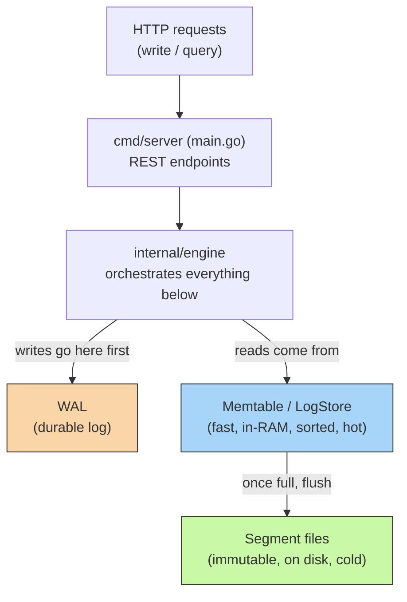
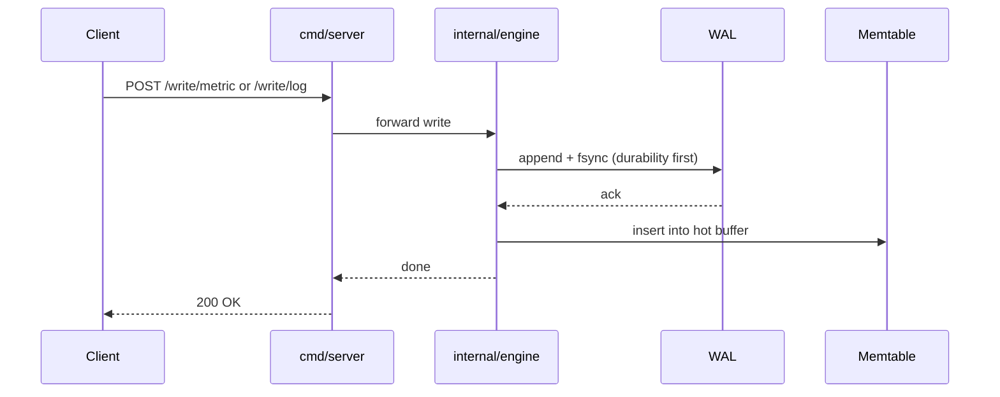

# homelab-tsdb

A single-binary, Go-native time-series + log store built for homelabs — the answer to *"why do I need Prometheus + Loki + Grafana + a message queue just to know if my Plex server is healthy."*

One process. No external dependencies. Runs comfortably on a Raspberry Pi.

Started as a personal project, fully separate from any day job, aimed at eventually becoming a real product for the self-hosting community.

## Architecture at a glance

### Write path (sequence)

## The four building blocks

**1. WAL (`internal/wal`) — robustness**
Every write is appended to a file and `fsync`'d to disk *before* the caller is told "done." This is the crash guarantee — tested by `kill -9`'ing the server mid-write (no graceful shutdown, the worst case) and confirming the write still came back after restart via `Replay()`. Same durability pattern every real database uses.

**2. Memtable + LogStore (`internal/storage`) — fast in-memory query**
Two parallel in-memory buffers:
- One for numeric metric `Point`s (sorted by timestamp per series)
- One for text `LogEntry`s (sorted by timestamp, filterable by source/level/substring)

This is what makes recent data queryable instantly without touching disk.

**3. Segments (`internal/storage/segment.go`) — bounded memory, durable storage**
Once the hot buffers pass a size threshold, their contents are gob-encoded and written atomically (temp file + rename, so a crash mid-flush can't corrupt an existing segment) to an immutable file on disk. After a successful flush, the WAL is truncated to zero and the in-memory buffers clear — this is what stops memory from growing forever.

Verified: WAL size drops to 0 after flush, and data queries correctly after a full restart, proving it was read back from the segment file, not just memory.

**4. Envelope (`internal/storage/envelope.go`) — one log, two data types**
A single-byte "kind" tag lets one WAL stream carry both metric points and log entries, so there's no need for two separate durability systems.

**Engine (`internal/engine`)** ties all of this together: on startup it replays the WAL (recovering anything since the last flush) then loads existing segments (recovering everything before that), giving one consistent view across "hot" and "cold" data for both writes and queries.

## API

`cmd/server` exposes everything over HTTP on `:8428`, all JSON in/out:

| Method | Endpoint | Purpose |
|---|---|---|
| `POST` | `/write/metric` | Write a metric point |
| `POST` | `/write/log` | Write a log entry |
| `GET` | `/query/metrics` | Query metric points |
| `GET` | `/query/logs` | Query log entries (filter by source/level/substring) |
| `POST` | `/flush` | Force a flush of hot buffers to a segment |
| `GET` | `/health` | Health check |

## What's actually been proven (not just claimed)

- ✅ Write → query round-trip for both metrics and logs, including log filtering by level and substring
- ✅ Flush produces a real segment file and truncates the WAL
- ✅ Data survives a clean restart, reading correctly from the segment
- ✅ Data survives a **hard kill (`-9`)** immediately after a write, recovered via WAL replay on the next start
- ✅ Code is `gofmt`-clean and passes `go vet`

## Current limitations (the honest gaps)

- No auth — anyone who can reach the port can read/write anything
- No TLS
- No compaction (old segments just accumulate, never merged/downsampled)
- No tests (this is genuinely the top priority before adding more features)
- Single node — no replication, no HA
- Cold data is fully loaded into RAM on startup (fine at homelab scale, won't scale to huge datasets as-is)

## Roadmap status

- ✅ **Phase 1** — WAL + memtable + basic queries
- 🟡 **Phase 2** — Flush-to-disk done ahead of schedule (turned out to be needed early); compaction and retention/downsampling still open
- 🟡 **Phase 3** — HTTP ingest + query API done; Grafana-compatible query format still open
- ⬜ **Phase 4** — Packaging as a single static binary + Docker image — not started

**Recommended next step:** tests, then auth — not a new feature. "Enterprise-worthy with zero test coverage" doesn't hold together, and untested code is the riskiest thing to keep building on top of.
